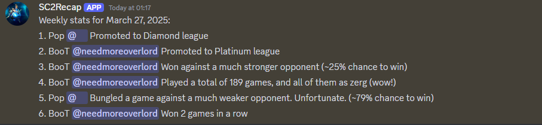

# SC2Recap
[](https://github.com/Pop101/SlowChat/issues)

A Discord bot that scans messages for BattleNet accounts and provides StarCraft 2 player statistics and recaps.



# Table of Contents
- [SC2Recap](#sc2recap)
- [Table of Contents](#table-of-contents)
- [Overview](#overview)
- [Technologies](#technologies)
- [Pre-Hosted Instance](#pre-hosted-instance)
  - [Slash Commands](#slash-commands)
- [Self-Hosting](#self-hosting)
  - [Installation](#installation)
  - [Configuration](#configuration)
    - [Configuration Options](#configuration-options)
  - [Usage](#usage)
  - [Contributing](#contributing)

# Overview
SC2Recap is a Discord bot that scans messages for BattleNet accounts, tracks StarCraft 2 player statistics, and generates weekly recaps. It's designed to help StarCraft 2 communities keep track of player activities and achievements.

# Technologies
This project is created with:
- [discord.py](https://discordpy.readthedocs.io/): ^2.3.2
- [pyyaml](https://pyyaml.org/): 6.0.1
- [anyascii](https://anyascii.com/): 0.3.2

# Pre-Hosted Instance
Invite my bot to your server: [https://discord.com/api/oauth2/authorize?client_id=1352571344805691485&permissions=2048&scope=bot%20applications.commands]

Note that my bot is subject to rate limits, may go down, and may be removed at any time. For a more reliable experience, consider self-hosting the bot.

## Slash Commands
These commands are for server administrators to set up the bot's functionality:

- `/set_scan` - Sets the current channel to be scanned for BattleNet accounts
  - Requires the `Manage Channels` permission
  - Use this command in the channel where you want SC2Recap to scan messages for BattleNet accounts

- `/set_weekly` - Sets the current channel for weekly StarCraft 2 statistics announcements
  - Requires the `Manage Channels` permission
  - Use this command in the channel where you want SC2Recap to post weekly recap announcements

After setting up these channels, the bot will:
1. Scan the designated scan channel for BattleNet accounts mentioned in messages
2. Track StarCraft 2 statistics for the identified accounts
3. Post weekly recaps in the designated weekly announcements channel
4. 
# Self-Hosting


## Installation
Clone the repository and install dependencies using Poetry:

```sh
git clone https://github.com/yourusername/SC2Recap
cd SC2Recap
pip install poetry
poetry install
```

## Configuration
Create a configuration file with your Discord bot token and other settings. The bot requires the following configuration options:

```yaml
# config.yaml or config.json
Token: "your-discord-bot-token-here"
Max Messages Scanned: 512  # Maximum number of messages to scan per channel
Hours Between Scans: 24    # Time between automatic channel scans
```

### Configuration Options

| Option                 | Description                                     | Default |
| ---------------------- | ----------------------------------------------- | ------- |
| `Token`                | Your Discord bot token (required)               | None    |
| `Max Messages Scanned` | Maximum number of messages to scan in a channel | 512     |
| `Hours Between Scans`  | Hours to wait between automatic channel scans   | 24      |

## Usage
Run the bot using Poetry:

```sh
poetry run python ./sc2recap.py
```

## Contributing
Contributions are welcome! Please feel free to submit a Pull Request. **Obvious AI-generated code, or code not matching the project's style, will be rejected.**